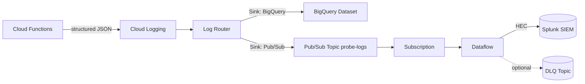

# 🚀 GCP Logging + Pub/Sub + Dataflow (1‑Hour Workshop)

## 🧭 Introduction
- Purpose: Show how we bootstrap CI/CD, build versioned artifacts, deploy Cloud Functions on schedules, and route logs into BigQuery and Pub/Sub (future: Dataflow → Splunk).
- You will: run bootstrap + secrets, tag a build, deploy functions, turn BigQuery and Pub/Sub sinks on, and toggle Pub/Sub subscriptions.
- Assumptions: intermediate GCP familiarity, gcloud + Terraform installed, access to the dev project.

Learning goals
- Bootstrap OIDC and buckets for artifact publishing and Terraform state.
- Build artifacts on tags and control deployed version in Terraform.
- Deploy scheduled Cloud Functions across regions; validate structured logs locally and in GCP.
- Operate Log Router sinks (BigQuery, Pub/Sub) and toggle Pub/Sub subscriptions.

Session priorities
- Build artifacts promoted across environments (bootstrap → OIDC → GitHub secrets).
- Bootstrap provisions artifact bucket and Terraform state buckets (dev/prod).
- Cloud Functions write uniform JSON logs; test locally with curl.
- CI/CD gated by tests (pytest) before artifact publish.
- Code: Python Cloud Functions; infra: Terraform; sinks: BigQuery and Pub/Sub.
- Pub/Sub integrates cleanly with third parties via Dataflow (not demoed today); do demo subscription on/off.
- Terraform scales entry points by region on schedules.
- Artifacts come from Git tags; Terraform pins deployed versions.

---

## 🗓️ 60‑Min Agenda
- 0–5 min: Objectives + architecture
- 5–20 min: Bootstrap OIDC + GitHub secrets + tag build
- 20–35 min: Terraform deploy (functions + scheduler) and log validation
- 35–45 min: BigQuery sink (verify dataset, query sample rows)
- 45–55 min: Pub/Sub sink + demo creating/deleting subscriptions
- 55–60 min: Takeaways + next steps (Dataflow → Splunk)

---

## 🧱 Architecture Overview
Textual flow
- Cloud Functions emit structured JSON to Cloud Logging.
- Log Router applies filters and exports:
  - Pub/Sub (stream for processors/forwarders)
  - BigQuery (analytics, retention)
- Dataflow subscribes to Pub/Sub, transforms/enriches, and forwards to Splunk HEC.
- Infra is serverless‑first and provisioned via Terraform; CI/CD uses GitHub OIDC to access artifact and state buckets.



Why this design
- Pub/Sub decouples producers from consumers; buffers bursts.
- Dataflow centralizes transforms and robust delivery (retries, backpressure).
- BigQuery supports analytics/compliance; Splunk supports security monitoring.
- Serverless + Terraform + OIDC → scale with minimal ops, no long‑lived keys.

---

## ⚙️ Hands‑On Demo Commands
Dev‑ready values baked in. Follow in order from repo root.

Set environment
```bash
PROJECT="payments-test-runner-dev"   # dev project from infra/dev/variables.tfvars
REGION="us-central1"                 # primary region used in dev
gcloud config set project "$PROJECT"
gcloud config get-value project
```

Step 1 — Bootstrap: OIDC + buckets (run once)
```bash
cd infra/bootstrap
terraform init
terraform apply -var-file=terraform.tfvars

# Capture outputs and set GitHub repo secrets
terraform output -raw release_bucket
terraform output -raw gcp_releaser_service_account
terraform output -raw gcp_workload_identity_provider
```
Set GitHub secrets (repo → Settings → Secrets and variables → Actions):
- `GCS_RELEASE_BUCKET_DEV` = value from `release_bucket`
- `GCP_RELEASER_SA_DEV` = value from `gcp_releaser_service_account`
- `GCP_WIF_PROVIDER_DEV` = value from `gcp_workload_identity_provider`

Step 2 — Build artifacts on tag (CI/CD runs pytest before publishing)
```bash
git tag v0.0.7-beta && git push origin v0.0.7-beta
# CI publishes to: gs://code-releases-payments-dev/releases/
# Expected: tsg-v0.0.7-beta.zip, worldpay-v0.0.7-beta.zip
```

Step 3 — Terraform deploy (functions + scheduler, BigQuery by default)
```bash
cd infra/dev
# Edit infra/dev/variables.tfvars as needed (see repo README for full example)
terraform init
terraform plan -var-file=variables.tfvars
terraform apply -var-file=variables.tfvars -auto-approve
```

Verify multi‑region scaling and schedules come from `functions` map in `infra/dev/variables.tfvars`.

Step 4 — BigQuery sink (enabled by default) and queries
```bash
gcloud logging sinks list --project="$PROJECT"
bq ls --project_id "$PROJECT" ${PROJECT}:payment_probe
bq head --project_id "$PROJECT" -n 5 payment_probe.run_googleapis_com_stderr
```

Example BigQuery queries
```bash
# Last 20 envelopes (stderr), newest first (works for partitioned or non‑partitioned)
bq query --use_legacy_sql=false --project_id="$PROJECT" '
  SELECT
    timestamp,
    jsonPayload.event.target AS target,
    jsonPayload.event.status AS status,
    jsonPayload.event.http_status AS http_status,
    jsonPayload.event.latency_ms AS latency_ms,
    jsonPayload.region AS region
  FROM `payment_probe.run_googleapis_com_stderr`
  WHERE jsonPayload.source = "gcp.payment-probe"
  ORDER BY timestamp DESC
  LIMIT 20'

# Count last hour (stderr)
bq query --use_legacy_sql=false --project_id="$PROJECT" '
  SELECT COUNT(1)
  FROM `payment_probe.run_googleapis_com_stderr`
  WHERE timestamp >= TIMESTAMP_SUB(CURRENT_TIMESTAMP(), INTERVAL 1 HOUR)
    AND jsonPayload.source = "gcp.payment-probe"'

# Across both streams (if stdout also exists)
bq query --use_legacy_sql=false --project_id="$PROJECT" '
  WITH logs AS (
    SELECT timestamp, jsonPayload FROM `payment_probe.run_googleapis_com_stderr`
    UNION ALL
    SELECT timestamp, jsonPayload FROM `payment_probe.run_googleapis_com_stdout`
  )
  SELECT COUNT(1)
  FROM logs
  WHERE timestamp >= TIMESTAMP_SUB(CURRENT_TIMESTAMP(), INTERVAL 1 HOUR)
    AND jsonPayload.source = "gcp.payment-probe"'
```

Optional: add a partition predicate (if the table shows timePartitioning in `bq show`)
```bash
# Append this to reduce scanned data when tables are ingestion‑time partitioned
#   AND _PARTITIONDATE >= DATE_SUB(CURRENT_DATE(), INTERVAL 1 DAY)
```

If partitioning is disabled (daily‑sharded tables)
```bash
bq query --use_legacy_sql=false --project_id="$PROJECT" '
  SELECT COUNT(1)
  FROM `payment_probe.run_googleapis_com_stderr_*`
  WHERE _TABLE_SUFFIX >= FORMAT_DATE("%Y%m%d", DATE_SUB(CURRENT_DATE(), INTERVAL 1 DAY))
    AND jsonPayload.source = "gcp.payment-probe"'
```

Step 5 — Enable Log Router → Pub/Sub sink (toggle in tfvars), then apply
```hcl
# infra/dev/variables.tfvars
# ...
# Export probe envelopes to Pub/Sub
enable_pubsub_sink = true
```
```bash
cd infra/dev
terraform apply -var-file=variables.tfvars -auto-approve
```

Create a temporary subscription (auto‑expires in 24h)
```bash
gcloud pubsub subscriptions create probe-logs-tmp \
  --topic=probe-logs \
  --expiration-period=24h \
  --project="$PROJECT"
```

Trigger a function to generate logs (sink publishes to Pub/Sub)
```bash
gcloud pubsub topics publish tsgpayments-topic-us-central1 \
  --message='{"action":"run"}' \
  --project="$PROJECT"

# Optional: also trigger the west region processor
gcloud pubsub topics publish worldpay-topic-us-west4 \
  --message='{"action":"run"}' \
  --project="$PROJECT"
```

Pull a few messages, then toggle subscription off/on
```bash
gcloud pubsub subscriptions pull --auto-ack probe-logs-tmp \
  --project="$PROJECT" --limit=5

# "Turn off" by deleting the subscription (no consumers)
gcloud pubsub subscriptions delete probe-logs-tmp --project="$PROJECT"

# "Turn on" by creating again (receives only new messages)
gcloud pubsub subscriptions create probe-logs-tmp \
  --topic=probe-logs \
  --expiration-period=24h \
  --project="$PROJECT"
```

Explore logs in Cloud Logging (structured JSON envelope)
```bash
# All probe envelopes
gcloud logging read 'jsonPayload.source="gcp.payment-probe"' \
  --project="$PROJECT" --limit=50 --format=json

# Narrow to a target
gcloud logging read 'jsonPayload.source="gcp.payment-probe" AND jsonPayload.event.target="tsgpayments"' \
  --project="$PROJECT" --limit=20 --format=json

# By Cloud Run service name (Functions Gen2 backends)
gcloud logging read \
  'resource.type="cloud_run_revision" AND resource.labels.service_name="tsgpayments-us-central1" AND jsonPayload.source="gcp.payment-probe"' \
  --project="$PROJECT" --limit=10 --format=json
```

Local test of the logging envelope (no deploy)
```bash
pip install -r functions/requirements.txt
python -m functions.local_server &
curl -X POST http://localhost:8080/tsg | jq
curl -X POST http://localhost:8080/worldpay | jq
```

Cleanup
```bash
# Delete temp sub if needed
gcloud pubsub subscriptions delete probe-logs-tmp --project="$PROJECT"
# Optionally toggle off the Pub/Sub sink in tfvars and apply again
```

Filters cheat sheet
```text
jsonPayload.source="gcp.payment-probe"
jsonPayload.event.target="tsgpayments"
severity=ERROR
```

---

## 🤖 AI Repo Analysis Prompts
- Show how bootstrap config works. Which outputs become GitHub secrets and where are they used in CI?
- Explain where Pub/Sub topics and Cloud Scheduler jobs are defined in infra/dev/main.tf.
- Identify both Log Router sinks (BigQuery, Pub/Sub). Summarize filters and IAM for sink writer identities.
- Trace how functions map from `infra/dev/variables.tfvars` (entry points, regions, schedules) to deployed resources.
- Show the structured logging envelope in functions and where source/sourcetype are set.
- Validate BigQuery dataset creation and partitioning settings.
- Provide a minimal validation plan for Pub/Sub routing using a temporary subscription.

Repo‑aware examples
- “Open infra/dev/main.tf and explain: google_cloudfunctions2_function.processor, google_cloud_scheduler_job.processor, google_pubsub_topic.processor.”
- “Explain google_logging_project_sink.probe_to_bq and .probe_to_pubsub and the IAM bindings.”
- “List variables in infra/dev/variables.tf that govern sinks and topics.”

---

## 🧠 Lab Exercises (Time‑boxed)
1) Create a Pub/Sub export sink (10 min)
- Set `enable_pubsub_sink = true` in `infra/dev/variables.tfvars` and apply.
- Validate: `gcloud logging sinks list` shows `probe-to-pubsub`; sink SA has `roles/pubsub.publisher` on `probe-logs`.

2) Publish and verify events (10 min)
- Publish to `tsgpayments-topic-us-central1`; pull from `probe-logs-tmp`.
- Validate payload contains `source=gcp.payment-probe` and `event.target` fields.
  
  Bonus: also publish to `worldpay-topic-us-west4` and confirm it flows.

3) Explore logs (10 min)
- Use `gcloud logging read` filters from the cheat sheet.
- Bonus: check BigQuery dataset `payment_probe` and head a table.

4) Dataflow preview (optional 10–15 min)
- Discuss roles/params and DLQ option; do not run in session (future integration).

---

## 🧭 Next Steps (Reference)
- Dataflow: Use the Pub/Sub → Splunk template with a dedicated subscription and worker SA. See `docs/prompt-splunk-dataflow.md`.
- Productionize sinks: refine filters, add DLQ topic, and set IAM least privilege.
- Enforce versioning: continue deploying tagged artifacts by pinning `artifact_object` in Terraform.

---

## 💬 Takeaways + Discussion
- Dual‑export: BigQuery for analytics, Splunk for security — controlled by Log Router filters.
- Pub/Sub decouples producers and consumers; Dataflow provides reliable delivery and transforms.
- Serverless + Terraform + OIDC keeps deployments simple and secure (no long‑lived creds).
- Structured JSON logs make downstream parsing robust and testable locally.

Discussion prompts
- Minimal envelope fields the team commits to for cross‑service consistency?
- Where to enforce PII redaction and schema validation — at source or in Dataflow?
- Sink design per env/severity/service — what’s the right split for us?
- SLIs/SLOs to watch (Pub/Sub backlog, Dataflow watermark, Splunk ingest latency)?

---

## 📎 Quick Pointers (Repo)
- Variables file: `infra/dev/variables.tfvars`
- Terraform stack: `infra/dev/main.tf`, `infra/dev/variables.tf`
- Example commands and filters: `README.md`
- Dataflow prompt: `docs/prompt-splunk-dataflow.md`
- Pub/Sub sink prompt: `docs/prompt-pubsub-sink.md`
- BigQuery sink prompt: `docs/prompt-bq-sink.md`
